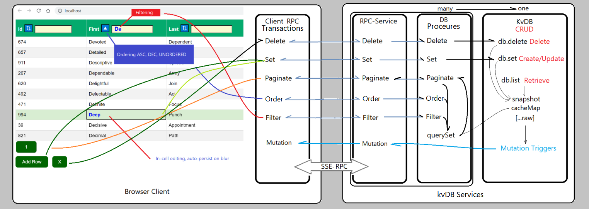

# KvDB service (Deno)
	One or more snapshotServices register for specific DB (file, collection)
	  relationships are handled by the snapshot as key-union collections	
	    If not found -> a kvDB with initial objects is created from opts{sample, size}
                kvDB service instance provides CRUD-RPC - DELETE, GET, GETMANY, GETALL, SET 
		Recieves snapshot-RPC-Read events -> many or all
		Recieves snapshot-RPC-mutations Create, Update, Delete ->
		   On-Mutation -> SSE -> {mutationType, ID(s)} 

# Snapshot-RPC service (Deno) one-or-more per kvDB service
	Registers for one or more object-collections on KvDB service ^^^
		On registration-ACK, kvDB-RPC-Fetch will populate collections
		Manages in-memory es6-Maps for each: collection, column indices, relation-union(s).
		Handles and reports local mutations as async RPC-transaction to KvDB - awaits ACK
		Monitors DB mutation events from KvDB with Tranaction-ACK/NACK 

# kvDB-RPC-Client lib (TS -> JS -> Browser)
	Registers for one or more Object Stores
	On registration-ACK, Fetch current 'Page' data -> renders Page-GUI
	On user-mutations/ui-events, sends async (transaction-wrapped) RPC events - CREATE, READ(paginate w/order/filter), UPDATE, DELETE.  Note: A client RPC-transaction wrap the corresponding kvDB transaction. 
	Responds to unsolicited MUTATION events from kvDB (SSE). Triggered by other users mutations

# Example GUI App
	Uses kvDB-RPC-Client lib
	Provides a simple editable table view.
	Provides Filter/Order UI per db-column.
	Provides Paging Buttons to simplify UI design
	Provides an Add-Row Button to add a row to the db
	Provides a Delete-Row Button whenever a row is focused (selected)
	Highlights a focused cell and automatically updates any mutation on cell-blur(row-update)