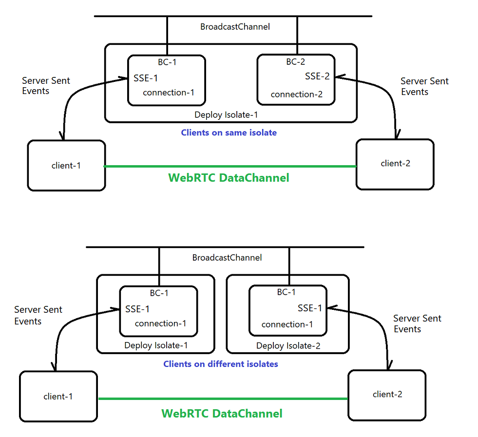

# Deno WebRTC Communications 

This library is a support service for a Deno Deploy app:    
https://github.com/nhrones/FreshDiceRTC

I built this because I was having many issues with determinism of the Deploy WebSockets and SSE.   

I decided to simply use Deploy as an app and signal server, and then just rely on WebRTC for real-time game-events. This worked extremely well!   

 

 
 
 

This lib includes:    
  *  A Deno-Deploy Signal Service     
        *  Client =  signaling.ts    
        *  Server + Signal-service = FreshDiceRTC -> routes/api/sse.ts    
  *  WebRTC connection module    
  *  A Peer management module

The main issue with this architecture is that all peers are responsible for maintaining a syncronized state. 
 
 

 
 

## See it: 
Open two instances of https://fresh-dice-rtc.deno.dev/

After the second instance(Peer) establishes a connection, the signal-server is no longer required.  All further game communication is via the established `WebRTC-dataChannel`.      
You can view the RTC coms logs by opening the chrome devtools console.    